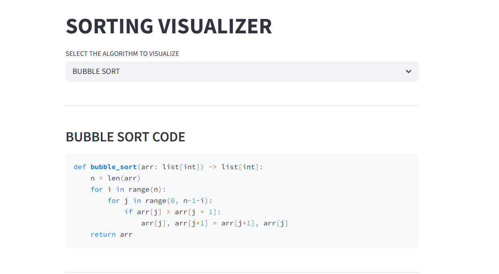
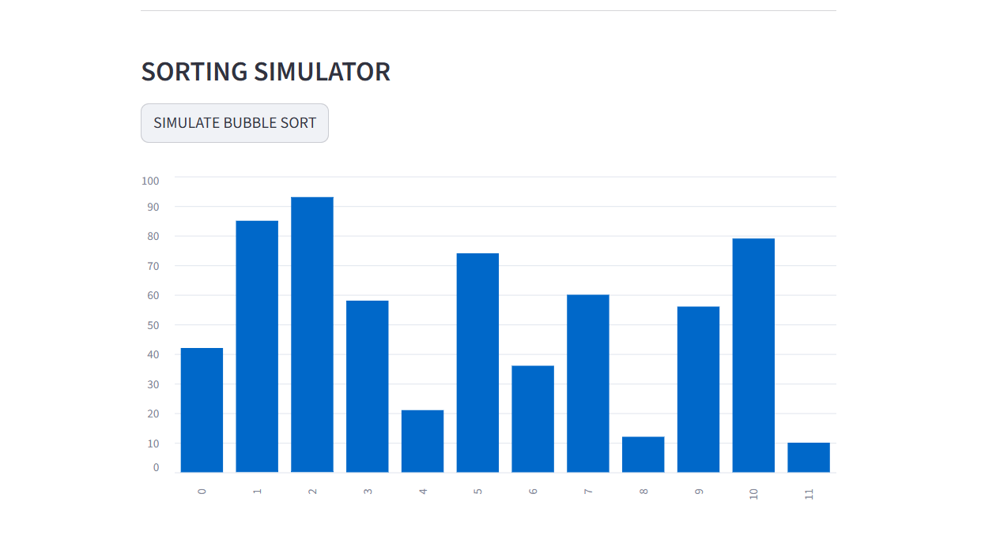

# SORTING VISUALIZER - STREAMLIT

- A **Streamlit** supported **Sorting Visualizer** to Simulate Basic Sorting Algorithms and Visualize them for better Understanding.
- Focuses on **Better Understanding**, **State Management** and **Convenient UI**

## FEATURES
- Optional Choice over Algorithm
- Python Code Presentation
- Visual Animation of Sorting using Bar Charts

## Live Hosting
- Live App Hosted on Streamlit Cloud Services
- `https://sorting-visualizer-tanishkbhatt.streamlit.app`

## Tech Stack Used
- Language : `python`
- UI Integration and Visualization : `streamlit`

## Author and Links
- Made by Tanishk Bhatt - A Student and A Programmer
- GITHUB : https://github.com/TanishkBhatt
- PORTFOLIO : https://tanishkbhatt.github.io/TanishkBhatt/

---
